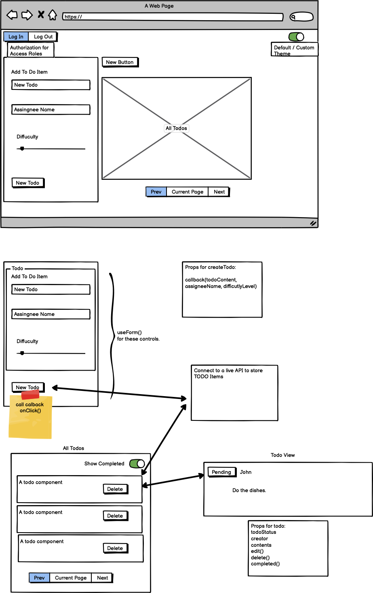

# Todo-App

## Live Deploy

[Netlify](https://yamada-todo.netlify.app/)

## Overview

A React frontend for simple Todo system that would take user input to add, update and delete todo items. An introduction to React context.

## Deployment

How do I install the app or library? 
Clone this app and install all dependencies. 
 

For Applications: 
How do I run the app? 
You can run the app on your local terminal. 
How do I set up the app? 
Be sure to install all dependencies. 

## Testing

Run [nmp test] to run the tests.
- Tests that User should be able to send a request.

## Documentation

UML 

